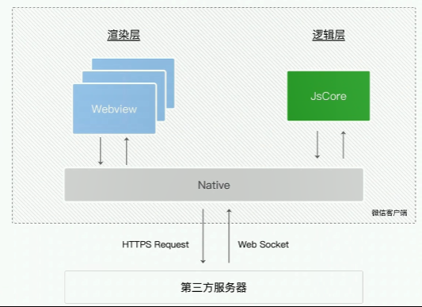
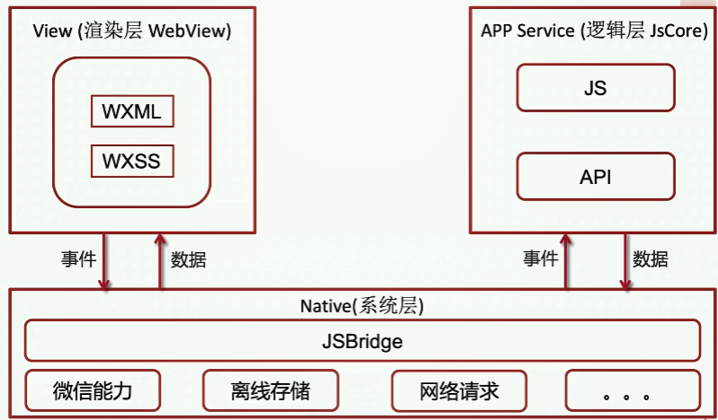
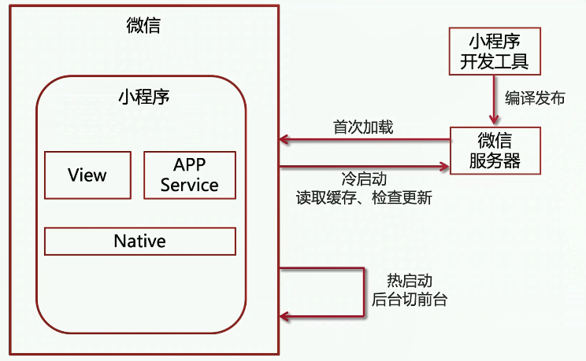

# 小程序原理剖析        

## 小程序渲染层与逻辑层交互原理

|  | 网页开发 | 小程序开发 |
| :-----| ----: | :----: |
| 结构 | HTML | WXML |
| 样式 | CSS | WXSS |
| 逻辑 | JavaScript | JavaScript |
| DOM操作 | DOM API | - |
| 渲染层和逻辑层 | 互斥的 | 分开的 |                

| 运行环境 | 逻辑层 | 渲染层 |
| :-----| ----: | :----: |
| IOS | JavaScriptCore | WKWebView |
| Android | V8 | 定制内核 |
| 小程序开发者工具 | NW.js | Chromium Webview |    

### 小程序渲染层与逻辑层        

        

            

## 小程序运行机制与更新机制            

- 冷启动(初次打开/被销毁重新打开)与热启动(一定时间内再次打开)       
- 前台与后台        
- 小程序销毁(进入后台大概超过五分钟被小程序主动销毁/占用内存过高微信主动销毁)       
  

  

