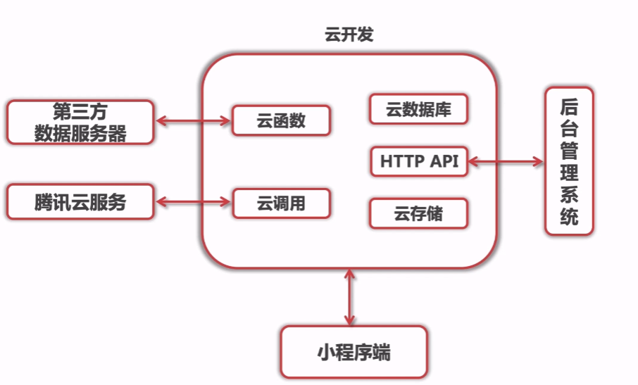

# minapp

> 基于小程序云开发的全栈音乐项目    
> minapp + Serverless + Koa         

## 小程序云开发模式

       

### 云开发优势      

* 快速上线      
* 专注核心业务      
* 独立开发一个完整的微信小程序      
* 只需要JavaScript      
* 无需运维      
* 云数据库可弹性扩展性能        
* 数据安全          

### 云开发能力      

* 云函数：在云端运行的代码，微信私有协议天然鉴权        
* 云数据库：一个既可以在小程序端操作又可以在云函数中操作的JSON数据库        
* 云存储：在云端存储文件，可以在云端控制台可视化管理        
* 云调用：基于云函数免鉴权使用小程序开发接口的能力      
* HTTP API：使用http api可在已有服务器上访问云资源，实现与云开发的互通      


## 项目结构

mini：微信小程序目录
````
├── cloudfunctions // ---- 云函数模块
│   ├── login
│   └── openapi
└── miniprogram   // ---- 小程序前端代码
│   ├── components 
│   └── images
│   ├── pages 
│   └── style
│   ├── app.js   // ---- 描述小程序的整体文件
│   └── app.json  // ---- 当前项目的全局配置文件
│   ├── app.wxss  // ---- 全局样式
│   └── sitemap.json // ---- 设置小程序能否被索引
└── project.config.json  // ---- 小程序配置文件
````

## 小程序原理剖析       

[小程序原理剖析](./PRINCIPLE.md)        

## 协议     

[MIT](./LICENSE)